# E-Commerce Clickstream Analysis System

An end-to-end Big Data pipeline implementing a **Kappa Architecture** to process real-time e-commerce user events. The system ingests clickstream data, performs real-time aggregation for alerts, and orchestrates daily reporting.

## 🎬 Quick Overview

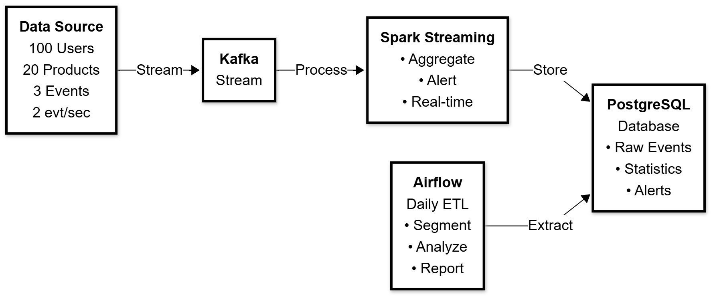

**Pipeline**: Producer → Kafka → Spark Streaming → PostgreSQL ← Airflow  
**Processing**: Real-time stream analytics + Daily batch reporting  
**Output**: Alerts, user segments, product analytics, CSV reports

---

## 📑 Table of Contents

- [Quick Overview](#-quick-overview)
- [Kappa Architecture Pattern](#-kappa-architecture-pattern)
- [Event Processing Timeline](#️-event-processing-timeline)
- [System Architecture](#-system-architecture)
- [Data Flow Diagram](#-data-flow-diagram)
- [Spark Streaming Processing Logic](#-spark-streaming-processing-logic)
- [Airflow DAG Structure](#-airflow-dag-structure)
- [Database Schema](#️-database-schema)
- [Technology Stack](#️-technology-stack)
- [Architecture Components](#-architecture-components)
- [Key Features](#-key-features)
- [How It Works: End-to-End Flow](#-how-it-works-end-to-end-flow)
- [Use Cases](#-use-cases)
- [Getting Started](#-getting-started)
- [Running the Pipeline](#️-running-the-pipeline)
- [Monitoring & Metrics](#-monitoring--metrics)
- [Troubleshooting](#-troubleshooting)
- [Project Structure](#-project-structure)
- [Architecture Decisions](#️-architecture-decisions)
- [Future Enhancements](#-future-enhancements)
- [Learning Outcomes](#-learning-outcomes)

## 🎯 Kappa Architecture Pattern

This project implements a **Kappa Architecture** where streaming is the primary processing paradigm:

```
                    ┌─────────────────────────────────────┐
                    │       KAPPA ARCHITECTURE             │
                    └─────────────────────────────────────┘
                                                            
    All Data Flows Through a Single Stream Processing Path
    ════════════════════════════════════════════════════════
                                                            
    Data Source          Stream Layer            Serving Layer
    ───────────         ─────────────            ─────────────
         │                                              
         │                                              
    ┌────▼────┐         ┌──────────┐           ┌──────────────┐
    │ Kafka   │────────▶│  Spark   │──────────▶│  PostgreSQL  │
    │ Stream  │         │ Streaming│           │   (OLAP)     │
    └─────────┘         └──────────┘           └──────────────┘
         │                    │                        │
         │                    │                        │
         ▼                    ▼                        ▼
    Immutable            Real-time              Fast Queries
    Event Log            Processing             & Analytics
                                                            
    Benefits:                                               
    ✓ Single codebase for stream processing                
    ✓ Real-time insights with low latency                  
    ✓ Simplified architecture vs Lambda                    
    ✓ Event replay capability from Kafka                   
    ✓ No separate batch processing layer needed            
```

## ⏱️ Event Processing Timeline

```
Time →  0s          5s          10s         15s         20s
        │           │           │           │           │
Events: ●●●●●       ●●●●        ●●●●●       ●●●        ●●●●●
        │           │           │           │           │
        └───────────┴───────────┴───────────┴───────────┘
                        │
                        ▼
            ┌───────────────────────┐
            │  Kafka Buffer         │
            │  (Topic: clickstream) │
            └───────────────────────┘
                        │
                        ▼
            ┌───────────────────────┐
            │  Spark Streaming      │
            │  Watermark: 1 min     │
            │  Window: 10 min       │
            │  Slide: 5 min         │
            └───────────────────────┘
                        │
        ┌───────────────┼───────────────┐
        ▼               ▼               ▼
   [Raw Data]    [Aggregations]    [Alerts]
   append mode    update mode       filtered
        │               │               │
        ▼               ▼               ▼
    PostgreSQL     PostgreSQL      PostgreSQL
   activity_logs  product_stats     alerts
                        │
                        ▼
            Daily @ Midnight (Airflow DAG)
                        │
        ┌───────────────┼───────────────┐
        ▼               ▼               ▼
    [Segment]      [Top 5]         [Report]
    user_segments  top_products    CSV Export
```

## 📊 System Architecture

```
┌─────────────────────────────────────────────────────────────────────────────┐
│                        E-COMMERCE CLICKSTREAM PIPELINE                       │
└─────────────────────────────────────────────────────────────────────────────┘

┌──────────────┐         ┌──────────────┐         ┌─────────────────────────┐
│   Producer   │────────▶│    Kafka     │───────▶│   Spark Streaming       │
│   (Python)   │  JSON   │  Message     │  Stream │   - Parse Events        │
│              │  Events │   Broker     │  Read   │   - Aggregate Windows   │
│ - 100 Users  │         │              │         │   - Alert Detection     │
│ - 20 Products│         │ Topic:       │         │   - Real-time Process   │
│ - 3 Events   │         │ clickstream  │         │                         │
└──────────────┘         └──────────────┘         └─────────────────────────┘
                                │                            │
                                │                            ▼
                                │                  ┌─────────────────────┐
                                │                  │    PostgreSQL DB    │
                                │                  │                     │
                                │                  │  Tables:            │
                                │                  │  • activity_logs    │
                                │                  │  • product_stats    │
                                │                  │  • alerts           │
                                │                  │  • user_segments    │
                                │                  │  • top_products     │
                                │                  └─────────────────────┘
                                │                            ▲
                                │                            │
                                ▼                            │
                     ┌─────────────────────┐                 │
                     │   Airflow (DAG)     │─────────────────┘
                     │                     │   Daily ETL
                     │  Orchestration:     │
                     │  • User Segment     │
                     │  • Top Products     │
                     │  • CSV Reports      │
                     └─────────────────────┘
```

## 🔄 Data Flow Diagram

```
Event Generation          Message Queue           Stream Processing          Storage
─────────────────        ─────────────────       ─────────────────────      ────────────

   Producer                   Kafka                Spark Structured          PostgreSQL
   ────────                   ─────                     Streaming             ─────────
                                                        ─────────
                                                             
┌──────────┐            ┌──────────┐             ┌─────────────────┐     
│ Generate │            │  Publish │             │  Read Stream    │     ┌─────────────┐
│  Events  │───────────▶│   to     │───────────▶│  from Kafka     │     │   Raw Data  │
│          │  {JSON}    │  Topic   │   Consume   │                 │────▶│ activity_   │
└──────────┘            └──────────┘             │  Parse JSON     │     │   logs      │
                                                 │                 │     └─────────────┘
  Events:                 Buffering              │  Apply Schema   │     
  • view                  & Delivery             │                 │     
  • add_to_cart           Guarantee              │  Watermarking   │     ┌─────────────┐
  • purchase                                     │                 │     │ Aggregated  │
                                                 │  Window Aggr.   │────▶│  product_   │
  Rate: 2 events/sec                             │  (10 min / 5m)  │     │   stats     │
                                                 │                 │     └─────────────┘
                                                 │  Alert Logic    │     
                                                 │  (views>100 &   │     ┌─────────────┐
                                                 │   purchases<5)  │────▶│   alerts    │
                                                 └─────────────────┘     └─────────────┘
                                                          │
                                                          │
                                                 ┌────────▼────────┐
                                                 │  Console Output │
                                                 │  (Monitoring)   │
                                                 └─────────────────┘
```

## 🎯 Spark Streaming Processing Logic

```
┌──────────────────────────────────────────────────────────────────────┐
│                    SPARK STRUCTURED STREAMING                         │
└──────────────────────────────────────────────────────────────────────┘

    Kafka Stream Input
          │
          ▼
    ┌─────────────────┐
    │  Parse JSON     │ ──▶ Schema: {user_id, product_id, 
    │  from Kafka     │              event_type, timestamp}
    └─────────────────┘
          │
          ├──────────────────────┬─────────────────────────┐
          │                      │                         │
          ▼                      ▼                         ▼
    ┌─────────────┐      ┌──────────────────┐     ┌────────────────┐
    │ Raw Stream  │      │  Watermarked     │     │  Window        │
    │  writeStream│      │  Stream          │     │  Aggregation   │
    │             │      │  (1 min delay)   │     │                │
    │  ▼          │      │      ▼           │     │  ▼             │
    │ Append Mode │      │  Group By:       │     │  Window:       │
    │  to         │      │  - window()      │     │  10 minutes    │
    │ activity_   │      │  - product_id    │     │  Slide: 5 min  │
    │  logs       │      │                  │     │                │
    └─────────────┘      │  Aggregate:      │     │  ▼             │
                         │  - SUM(views)    │     │  Update Mode   │
                         │  - SUM(purchases)│     │                │
                         └──────────────────┘     └────────────────┘
                                  │                        │
                                  ▼                        ▼
                         ┌──────────────────┐    ┌────────────────┐
                         │  Alert Filter    │    │  Write to DB   │
                         │                  │    │  product_stats │
                         │  IF views > 100  │    └────────────────┘
                         │  AND purchases<5 │
                         │                  │
                         │  ▼               │
                         │  Generate Alert  │
                         │  "Flash Sale     │
                         │   Recommended"   │
                         │                  │
                         │  ▼               │
                         │  Write to        │
                         │  alerts table    │
                         └──────────────────┘
```

## 📅 Airflow DAG Structure

```
┌─────────────────────────────────────────────────────────────────────┐
│              DAILY USER SEGMENTATION DAG                             │
│              Schedule: @daily                                        │
└─────────────────────────────────────────────────────────────────────┘

    Start
      │
      ├────────────────────────────┬─────────────────────────────┐
      │                            │                             │
      ▼                            ▼                             ▼
┌──────────────────┐    ┌───────────────────┐     ┌────────────────────┐
│ create_          │    │ create_top_       │     │                    │
│ segmentation_    │    │ products_table    │     │                    │
│ table            │    │                   │     │                    │
└────────┬─────────┘    └─────────┬─────────┘     │                    │
         │                        │               │                    │
         ▼                        ▼               │                    │
┌──────────────────┐    ┌───────────────────┐     │                    │
│ segment_users    │    │ top_products      │     │                    │
│                  │    │                   │     │  PostgreSQL Ops    │
│ SQL Logic:       │    │ SQL Logic:        │     │                    │
│ - Buyers:        │    │ - Top 5 products  │     │  Extract data      │
│   purchases > 0  │    │ - Order by views  │     │  from activity_    │
│ - Window         │    │ - GROUP BY        │     │  logs table        │
│   Shoppers:      │    │   product_id      │     │                    │
│   views only     │    │                   │     │                    │
└────────┬─────────┘    └─────────┬─────────┘     └────────────────────┘
         │                        │                          │                    
         └────────────┬───────────┘                          │                    
                      │                                      │                    
                      ▼                                      │                    
            ┌───────────────────┐                            │                    
            │ generate_report   │                            │                    
            │                   │◀──────────────────────────┘                     
            │ Python Task:      │                                       
            │ - Calculate       │                                       
            │   conversion rate │                                       
            │ - Generate CSV    │                                       
            │ - Export to /tmp  │                                       
            └───────────────────┘                                       
                      │                                                 
                      ▼                                                 
              analytic_report.csv                                       
              ───────────────────                                       
              product_id | purchases | views | conversion_rate         
```

## 🗄️ Database Schema

```sql
-- Real-time Stream Data
┌─────────────────────────────────┐
│       activity_logs              │
├─────────────────────────────────┤
│ user_id      VARCHAR(50)         │
│ product_id   VARCHAR(50)         │
│ event_type   VARCHAR(20)         │
│ timestamp    TIMESTAMP           │
└─────────────────────────────────┘

-- Real-time Aggregations
┌─────────────────────────────────┐
│       product_stats              │
├─────────────────────────────────┤
│ window       STRUCT              │
│ product_id   VARCHAR(50)         │
│ total_views  BIGINT              │
│ total_purchases BIGINT           │
└─────────────────────────────────┘

-- Alert Management
┌─────────────────────────────────┐
│         alerts                   │
├─────────────────────────────────┤
│ window         STRUCT            │
│ product_id     VARCHAR(50)       │
│ total_views    BIGINT            │
│ total_purchases BIGINT           │
│ alert_message  VARCHAR(255)      │
│ alert_time     TIMESTAMP         │
└─────────────────────────────────┘

-- Daily Batch Processing
┌─────────────────────────────────┐
│       user_segments              │
├─────────────────────────────────┤
│ user_id      VARCHAR(50)         │
│ segment      VARCHAR(20)         │
│ date         DATE                │
└─────────────────────────────────┘

┌─────────────────────────────────┐
│       top_products               │
├─────────────────────────────────┤
│ product_id   VARCHAR(50)         │
│ total_views  BIGINT              │
│ date         DATE                │
└─────────────────────────────────┘
```

## 🛠️ Technology Stack

| Layer | Technology | Version | Purpose |
|-------|-----------|---------|---------|
| **Data Generation** | Python | 3.x | Event simulation and data generation |
| **Message Queue** | Apache Kafka | 7.4.0 | Distributed streaming platform for real-time data ingestion |
| **Stream Processing** | Apache Spark | 3.5.0 | Real-time data processing and aggregation |
| **Workflow Orchestration** | Apache Airflow | 2.7.1 | DAG scheduling and batch processing |
| **Data Storage** | PostgreSQL | 13 | Relational database for analytics |
| **Coordination** | Apache ZooKeeper | 7.4.0 | Kafka cluster coordination |
| **Containerization** | Docker & Docker Compose | Latest | Infrastructure management |

## 🏗 Architecture Components

### 1. **Ingestion Layer**
   - **Source**: Python Producer (`producers/producer.py`)
     - Simulates 100 users interacting with 20 products
     - Generates events: `view` (70%), `add_to_cart` (20%), `purchase` (10%)
     - Event rate: ~2 events/second
     - Output format: JSON with timestamp
   
   - **Message Broker**: Apache Kafka
     - Topic: `clickstream`
     - Ensures reliable, ordered event delivery
     - Decouples producers from consumers
     - Internal network: `kafka:29092`

### 2. **Stream Processing Layer**
   - **Engine**: Apache Spark Structured Streaming (`spark/stream_processor.py`)
   
   - **Processing Logic**:
     - **Watermarking**: 1-minute delay for handling late-arriving data
     - **Windowing**: 10-minute tumbling windows, sliding every 5 minutes
     - **Aggregations**: 
       - Count views per product per window
       - Count purchases per product per window
     
   - **Real-time Alerting**:
     - Condition: `total_views > 100 AND total_purchases < 5`
     - Action: Generate "Flash Sale Recommended" alert
     - Alert storage: PostgreSQL `alerts` table
   
   - **Data Sinks**:
     - `activity_logs`: Raw event stream (append mode)
     - `product_stats`: Windowed aggregations (update mode)
     - `alerts`: Real-time alerts with timestamp
     - Console: Monitoring and debugging output

### 3. **Storage Layer**
   - **Database**: PostgreSQL
     - Stores both streaming and batch processing results
     - 5 main tables: activity_logs, product_stats, alerts, user_segments, top_products
     - Connection: `postgres:5432/airflow`
     - Credentials: airflow/airflow

### 4. **Orchestration & Reporting Layer**
   - **Orchestrator**: Apache Airflow (`airflow/dags/daily_segmentation_dag.py`)
   
   - **DAG**: `daily_user_segmentation`
     - Schedule: Daily (`@daily`)
     - Tasks:
       1. **User Segmentation**:
          - Buyers: Users with at least 1 purchase
          - Window Shoppers: Users with views but no purchases
       2. **Top Products Analysis**:
          - Identifies top 5 most viewed products
          - Daily snapshot for trending analysis
       3. **Conversion Rate Report**:
          - Calculates: `purchases / views` per product
          - Exports CSV to `/tmp/analytic_report.csv`
   
   - **Web UI**: Accessible at `http://localhost:8081`
     - DAG visualization and monitoring
     - Task logs and execution history

## 💡 Key Features

- **Lambda Architecture**: Combines real-time streaming (hot path) with batch processing (cold path)
- **Fault Tolerance**: Kafka message persistence, Spark checkpointing
- **Scalability**: Distributed processing with Spark workers
- **Late Data Handling**: Watermarking strategy for out-of-order events
- **Alert System**: Real-time business intelligence for flash sale opportunities
- **Monitoring**: Airflow UI for job tracking, Spark UI for stream monitoring

## 🔍 How It Works: End-to-End Flow

### Real-Time Stream Processing (Hot Path)
1. **Producer** generates user events (view, add_to_cart, purchase) with timestamps
2. **Kafka** receives and buffers events in the `clickstream` topic
3. **Spark Streaming** consumes events and:
   - Parses JSON and applies schema validation
   - Applies watermarking (1-minute delay tolerance)
   - Creates 10-minute sliding windows (5-minute slides)
   - Aggregates views and purchases per product per window
   - Detects anomalies (high views, low purchases)
   - Writes to PostgreSQL in real-time:
     - Raw events → `activity_logs`
     - Aggregations → `product_stats`
     - Alerts → `alerts`

### Daily Batch Processing (Cold Path)
1. **Airflow scheduler** triggers `daily_user_segmentation` DAG at midnight
2. **DAG Tasks** execute sequentially:
   - Create tables if they don't exist
   - Query `activity_logs` to segment users
   - Identify top 5 most viewed products
   - Calculate conversion rates per product
   - Export results to CSV report
3. **Results** stored in:
   - `user_segments`: Daily user behavior classification
   - `top_products`: Trending products snapshot
   - `/tmp/analytic_report.csv`: Business intelligence report

## 📈 Use Cases

### 1. Real-Time Marketing (Hot Path)
**Scenario**: A product receives 150 views but only 3 purchases in a 10-minute window

**Action**: 
- Alert triggered automatically
- Recommendation: "Flash Sale Recommended"
- Marketing team can immediately launch targeted promotion

### 2. Customer Segmentation (Cold Path)
**Scenario**: Daily analysis of user behavior

**Insights**:
- **Buyers**: High-value customers who complete purchases
- **Window Shoppers**: Potential customers needing engagement
- Enable targeted email campaigns and personalized recommendations

### 3. Product Performance Analysis
**Scenario**: Identify trending and underperforming products

**Insights**:
- Top 5 most viewed products daily
- Conversion rates per product
- Inventory and marketing optimization decisions

### 4. Business Intelligence Reporting
**Scenario**: Executive dashboard data

**Deliverables**:
- Daily CSV reports with key metrics
- Historical trend analysis from PostgreSQL
- Product-level conversion funnel insights

## 🚀 Getting Started

### Prerequisites
-   Docker
-   Docker Compose

### Installation

1.  **Clone the repository**:
    ```bash
    git clone <repository-url>
    cd big-data-mini-project
    ```

2.  **Build and Start Services**:
    This command builds the custom producer image and starts Kafka, Zookeeper, Spark, Postgres, and Airflow.
    ```bash
    docker-compose up -d --build
    ```
    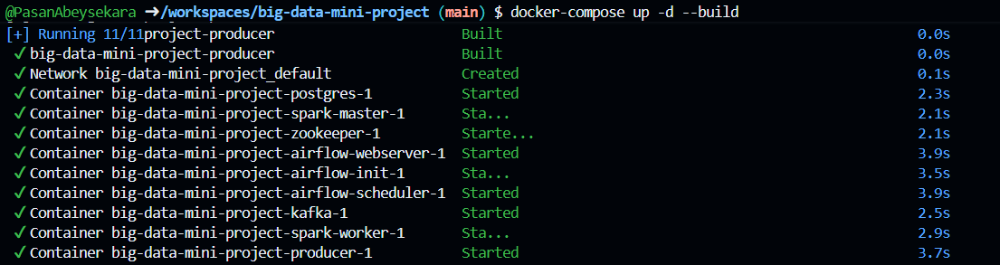

    At http://localhost:8080

    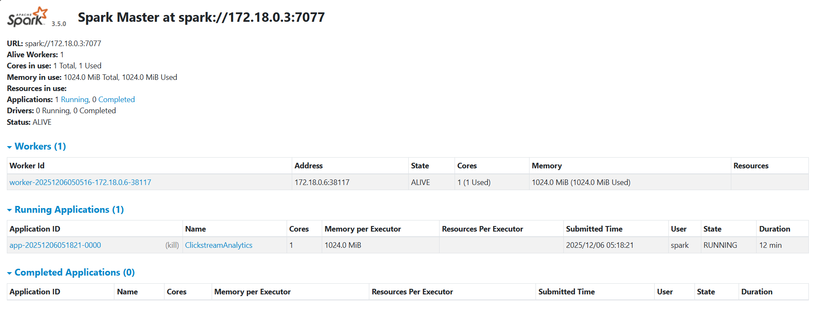

### 🏃‍♂️ Running the Pipeline

#### 1. Verify Data Ingestion
The producer starts automatically. Check its logs to see data being generated:
```bash
docker logs big-data-mini-project-producer-1 --tail 10
```

*You should see logs like `Sent: {'user_id': '...', 'event_type': 'view', ...}`.*
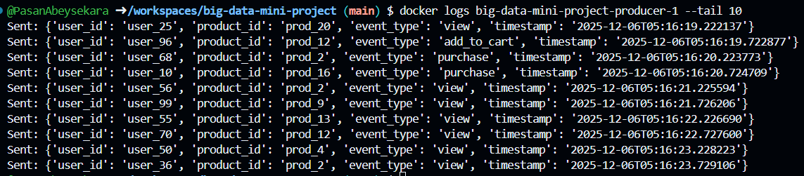


#### 2. Submit and Verify Spark Stream Processing

**Create the Ivy cache directory** (required for downloading Maven dependencies):
```bash
docker exec -u root big-data-mini-project-spark-master-1 bash -c "mkdir -p /home/spark/.ivy2/cache && chown -R spark:spark /home/spark/.ivy2"
```

**Submit the Spark streaming job**:
```bash
docker exec big-data-mini-project-spark-master-1 bash -c "nohup /opt/spark/bin/spark-submit \
  --master spark://spark-master:7077 \
  --packages org.apache.spark:spark-sql-kafka-0-10_2.12:3.5.0,org.postgresql:postgresql:42.6.0 \
  /opt/spark/work-dir/stream_processor.py > /opt/spark/work-dir/spark_job.log 2>&1 &"
```

**Verify the Spark job is running**:
```bash
docker exec big-data-mini-project-spark-master-1 ps aux | grep spark-submit
```

**View the Spark job logs**:
```bash
docker exec big-data-mini-project-spark-master-1 tail -30 /opt/spark/work-dir/spark_job.log
```

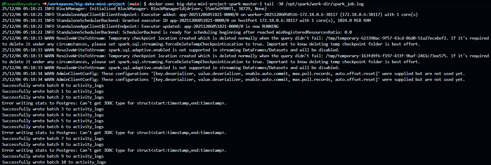

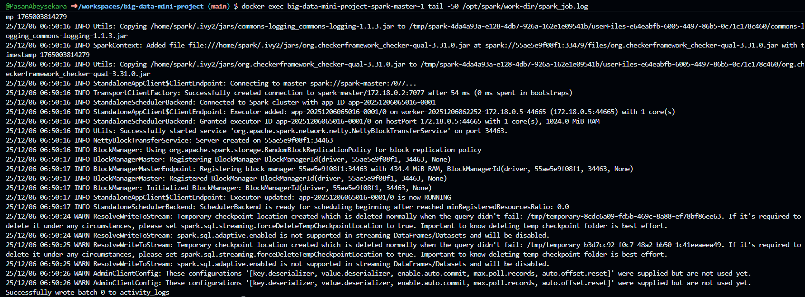

**Verify data is being written to PostgreSQL**:
```bash
docker exec big-data-mini-project-postgres-1 psql -U airflow -d airflow -c "SELECT count(*) FROM activity_logs;"
```
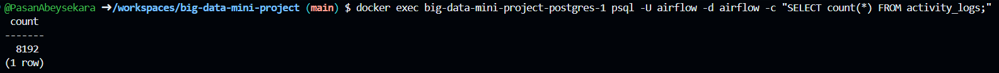

```bash
docker exec big-data-mini-project-postgres-1 psql -U airflow -d airflow -c "SELECT * FROM activity_logs LIMIT 5;"
```
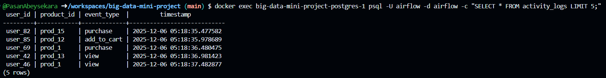


#### 3. Configure Airflow PostgreSQL Connection

Before triggering the DAG, configure the PostgreSQL connection:
```bash
docker exec big-data-mini-project-airflow-scheduler-1 airflow connections add postgres_default \
  --conn-type postgres \
  --conn-host postgres \
  --conn-schema airflow \
  --conn-login airflow \
  --conn-password airflow \
  --conn-port 5432
```

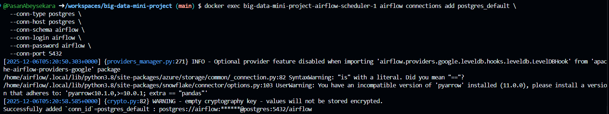

**Verify the connection**:
```bash
docker exec big-data-mini-project-airflow-scheduler-1 airflow connections get postgres_default
```

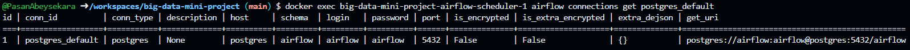

#### 4. Trigger Airflow DAG

**Access the Airflow Webserver** at `http://localhost:8081`:
-   **Username**: `admin`
-   **Password**: `admin`

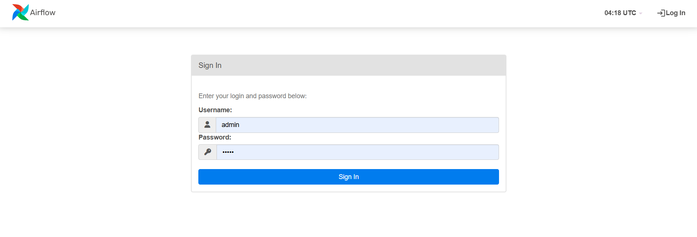

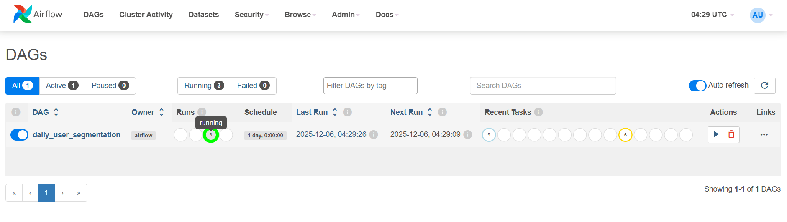

**Trigger the DAG from the UI** by clicking the "Trigger DAG" button on the `daily_user_segmentation` DAG.

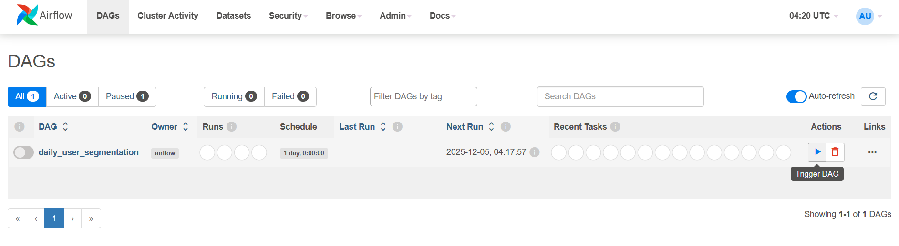

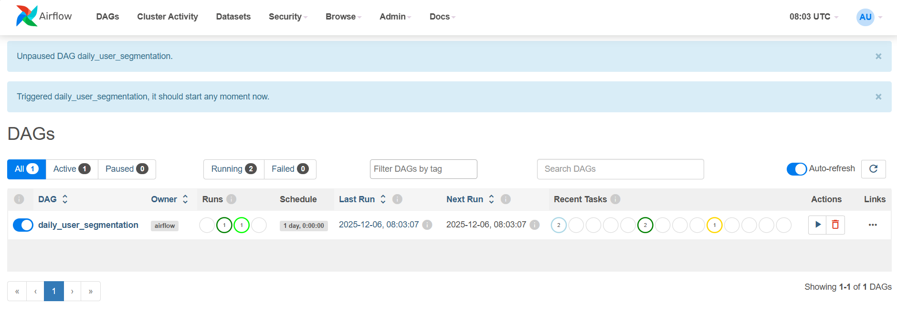

**Or trigger via CLI**:
```bash
docker exec big-data-mini-project-airflow-scheduler-1 airflow dags trigger daily_user_segmentation
```
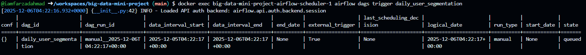

**Check DAG run status from the UI**:

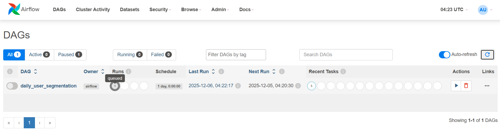

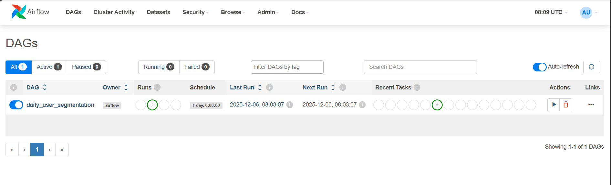

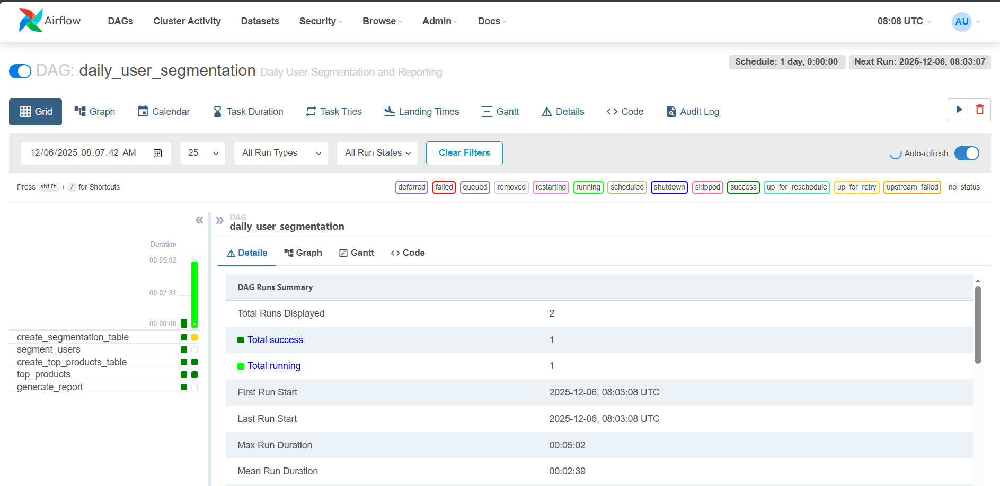

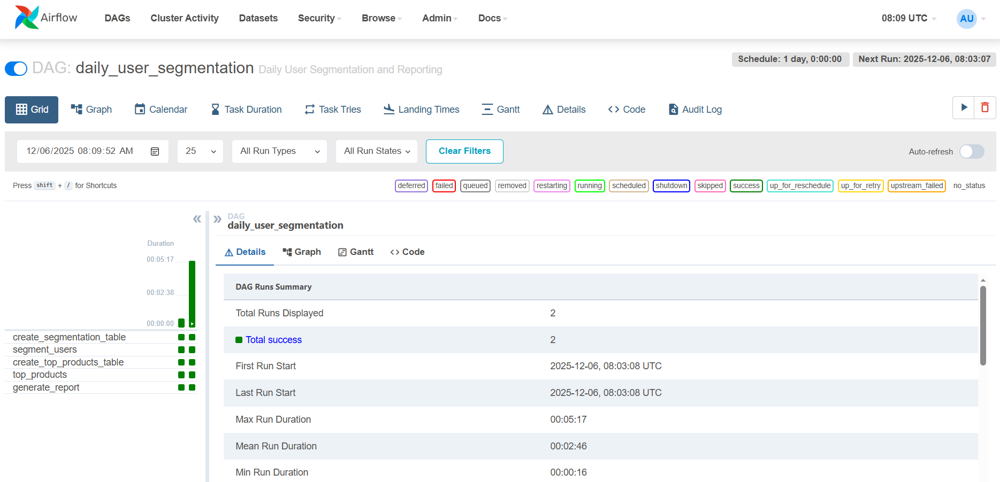

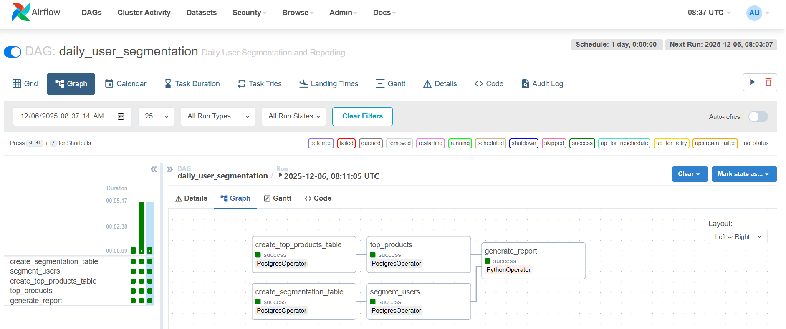

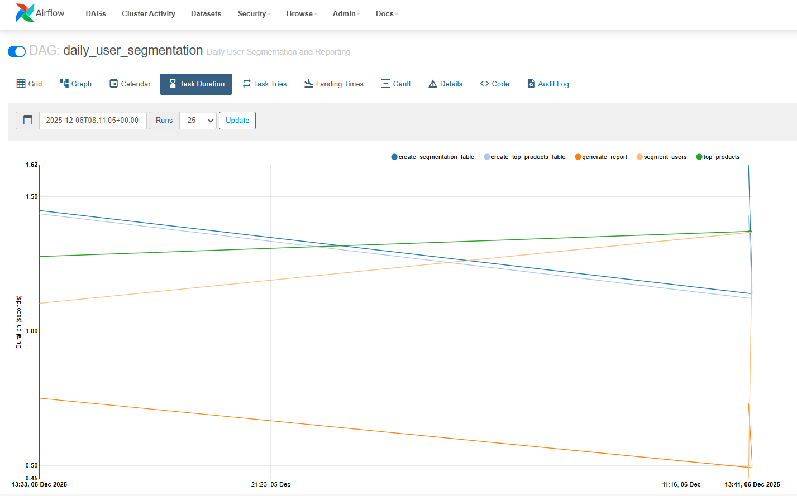

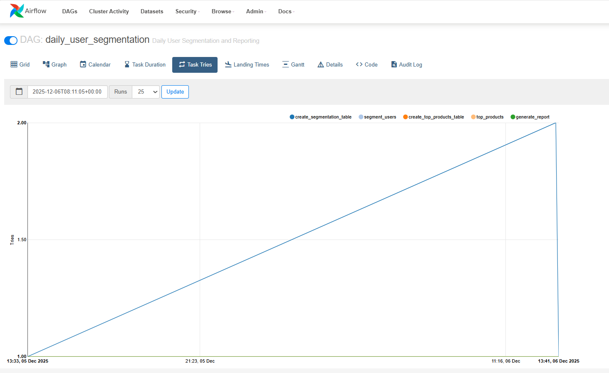

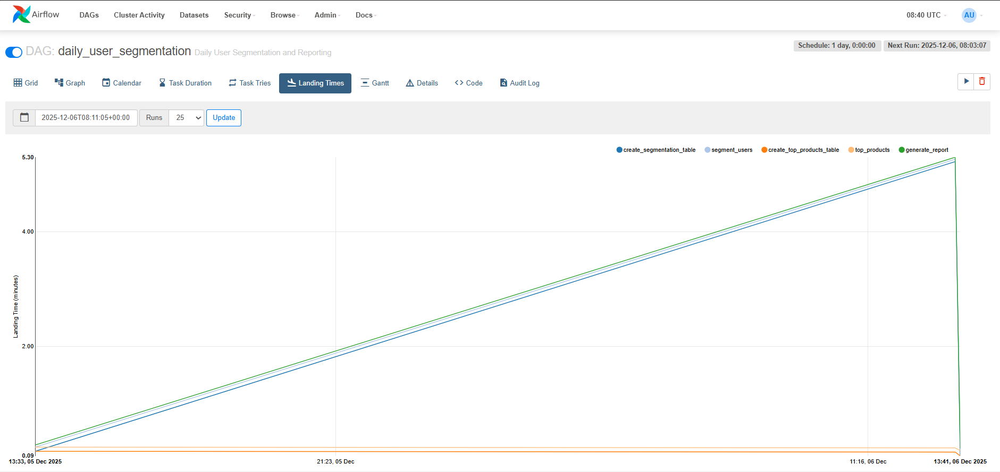

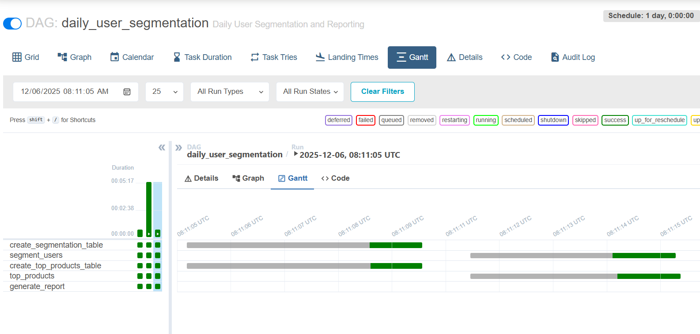

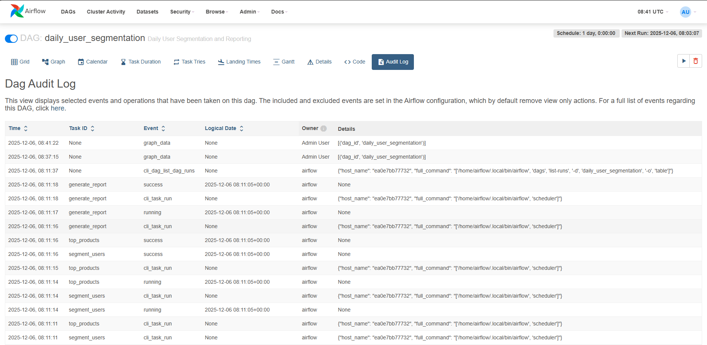

**Check DAG run status via CLI**:
```bash
docker exec big-data-mini-project-airflow-scheduler-1 airflow dags list-runs -d daily_user_segmentation -o table
```

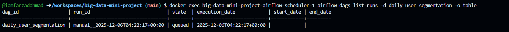

#### 5. View Reports and Results

**Copy the analytic report to your local machine**:
```bash
docker cp big-data-mini-project-airflow-scheduler-1:/tmp/analytic_report.csv .
```

**View the report**:
```bash
cat analytic_report.csv
```

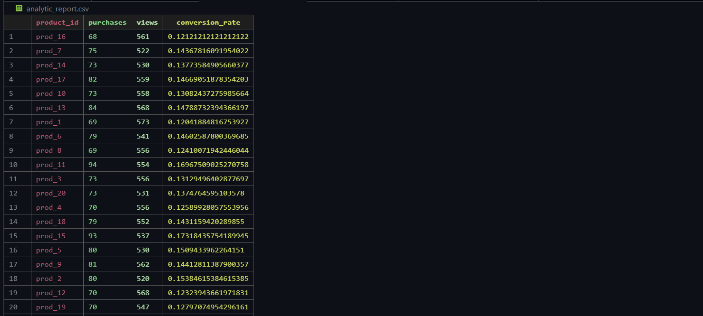

**Verify user segmentation results**:
```bash
docker exec big-data-mini-project-postgres-1 psql -U airflow -d airflow -c \
  "SELECT segment, COUNT(*) as count FROM user_segments GROUP BY segment;"
```
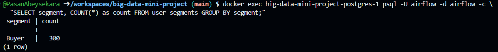

**View top 5 products**:
```bash
docker exec big-data-mini-project-postgres-1 psql -U airflow -d airflow -c \
  "SELECT * FROM top_products ORDER BY total_views DESC LIMIT 5;"
```
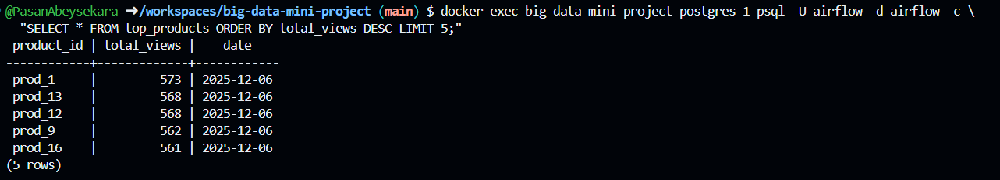

## 📊 Monitoring & Metrics

### System Health Checks

```bash
# Check all containers are running
docker ps

# Check Kafka is receiving events
docker exec big-data-mini-project-kafka-1 \
  kafka-console-consumer --bootstrap-server localhost:9092 \
  --topic clickstream --from-beginning --max-messages 10

# Check producer event rate
docker logs big-data-mini-project-producer-1 --tail 20

# Monitor Spark job progress
docker exec big-data-mini-project-spark-master-1 \
  tail -f /opt/spark/work-dir/spark_job.log

# Check PostgreSQL data growth
docker exec big-data-mini-project-postgres-1 psql -U airflow -d airflow -c \
  "SELECT 
    (SELECT COUNT(*) FROM activity_logs) as raw_events,
    (SELECT COUNT(*) FROM product_stats) as aggregations,
    (SELECT COUNT(*) FROM alerts) as alerts_generated,
    (SELECT COUNT(*) FROM user_segments) as user_segments;"
```

### Web Interfaces

| Service | URL | Credentials | Purpose |
|---------|-----|-------------|---------|
| **Airflow** | http://localhost:8081 | admin / admin | DAG monitoring, task logs, scheduling |
| **Spark Master** | http://localhost:8080 | None | Cluster resources, running applications |
| **Kafka** | localhost:9092 | None | Message broker (no UI, use CLI tools) |
| **PostgreSQL** | localhost:5432 | airflow / airflow | Database access via client |

### Performance Metrics

**Expected Throughput**:
- Producer: ~2 events/second = 172,800 events/day
- Spark Processing Latency: < 1 second per micro-batch
- Window Updates: Every 5 minutes
- Alert Detection: Real-time (within processing latency)
- Batch DAG Duration: 2-5 minutes (depends on data volume)

**Resource Usage** (Default Configuration):
- Spark Worker: 1 core, 1GB RAM
- Total Memory: ~4-6GB
- Storage Growth: ~100MB per day (estimated)

## 🛠 Troubleshooting

### Common Issues

| Issue | Symptom | Solution |
|-------|---------|----------|
| **Kafka NodeExists** | Kafka exits with code 1 | `docker-compose restart zookeeper kafka` |
| **Spark Connection Error** | "No resolvable bootstrap urls" | Ensure Kafka is running, restart Spark job |
| **Producer Build Fails** | Image not found | Use `build` context in docker-compose.yml |
| **Spark Package Download** | Ivy cache errors | Create `/home/spark/.ivy2/cache` with proper permissions |
| **Airflow Connection Error** | "Connection not found" | Create `postgres_default` connection |
| **Table Doesn't Exist** | SQL errors in DAG | Ensure Spark job has run and created tables |
| **Port Already in Use** | Container won't start | Stop conflicting services or change ports |

### Debug Commands

```bash
# Restart entire stack
docker-compose down && docker-compose up -d --build

# View logs for specific service
docker logs <container-name> --tail 100 -f

# Access container shell
docker exec -it <container-name> bash

# Reset Kafka (WARNING: deletes all data)
docker-compose down -v
docker-compose up -d

# Check network connectivity between containers
docker exec big-data-mini-project-spark-master-1 ping kafka

# Verify Spark job is running
docker exec big-data-mini-project-spark-master-1 ps aux | grep python
```

### Detailed Troubleshooting

-   **Producer image build fails**: Ensure the `docker-compose.yml` uses `build` context instead of trying to pull `local/producer` image.
-   **Spark job fails to start**: Create the `/home/spark/.ivy2/cache` directory with proper permissions (see Step 2 above).
-   **Spark can't download packages**: Ensure the Ivy cache directory exists and has write permissions for the `spark` user.
-   **Airflow DAG fails with connection error**: Create the `postgres_default` connection using the command in Step 3.
-   **activity_logs table doesn't exist**: The Spark streaming job must be running to create and populate this table. Check Spark job logs.
-   **Spark fails to connect to Kafka**: Ensure the Spark job is using the internal Docker network address for Kafka (`kafka:29092`), not localhost.
-   **Kafka crashes on restart**: Stale ZooKeeper nodes can cause issues. Restart both ZooKeeper and Kafka together.

## 📂 Project Structure

```
big-data-mini-project/
├── airflow/
│   └── dags/
│       └── daily_segmentation_dag.py  # Airflow DAG for batch processing
│                                      # - User segmentation SQL logic
│                                      # - Top products analysis
│                                      # - Conversion rate reporting
├── producers/
│   ├── Dockerfile                     # Custom Python producer image
│   ├── producer.py                    # Event generator (100 users, 20 products)
│   └── requirements.txt               # kafka-python dependency
├── spark/
│   └── stream_processor.py            # Spark Structured Streaming application
│                                      # - Kafka consumer
│                                      # - Windowed aggregations
│                                      # - Alert detection logic
│                                      # - PostgreSQL sink
├── docker-compose.yml                 # Multi-container orchestration
│                                      # - Kafka + ZooKeeper
│                                      # - Spark (master + worker)
│                                      # - Airflow (webserver + scheduler + init)
│                                      # - PostgreSQL
│                                      # - Producer
└── README.md                          # Comprehensive documentation
```

## 🏛️ Architecture Decisions

### Why Kappa over Lambda Architecture?
- **Simplified Codebase**: Single stream processing path reduces maintenance
- **Real-time Priority**: E-commerce requires low-latency insights
- **Event Replay**: Kafka retention allows reprocessing for corrections
- **Reduced Complexity**: No need to maintain separate batch and streaming code

### Technology Choices

| Decision | Rationale |
|----------|-----------|
| **Kafka** | Industry-standard for event streaming, high throughput, fault-tolerant |
| **Spark Streaming** | Unified batch/stream API, mature ecosystem, SQL support |
| **PostgreSQL** | ACID compliance, complex queries, joins for analytics |
| **Airflow** | Powerful orchestration, dependency management, monitoring UI |
| **Docker** | Environment consistency, easy deployment, isolation |

### Sliding Window Strategy
- **10-minute windows, 5-minute slides**: Balances granularity with processing overhead
- **1-minute watermark**: Accommodates network delays and clock skew
- **Update mode**: Efficiently handles late-arriving events

## 🚀 Future Enhancements

### Scalability Improvements
- [ ] **Kafka Partitioning**: Partition topic by `product_id` for parallel processing
- [ ] **Spark Workers**: Scale to multiple workers for increased throughput
- [ ] **Database Sharding**: Partition PostgreSQL by date for large datasets
- [ ] **Read Replicas**: Add PostgreSQL replicas for query performance

### Feature Additions
- [ ] **Machine Learning**: Product recommendation engine using Spark MLlib
- [ ] **Real-time Dashboard**: Grafana + TimescaleDB for live metrics visualization
- [ ] **Advanced Alerting**: 
  - Price drop opportunities
  - Cart abandonment detection
  - Inventory low-stock warnings
- [ ] **Data Lake Integration**: Archive raw events to S3/HDFS for long-term storage
- [ ] **Stream Enrichment**: Join with product catalog for richer analytics

### Operational Enhancements
- [ ] **Prometheus Metrics**: Export Spark and Kafka metrics
- [ ] **Schema Registry**: Confluent Schema Registry for event schema evolution
- [ ] **Backup Strategy**: Automated PostgreSQL backups
- [ ] **CI/CD Pipeline**: Automated testing and deployment
- [ ] **Kubernetes Migration**: Orchestrate with K8s for production-grade deployment

### Data Quality
- [ ] **Schema Validation**: Enforce strict JSON schema at producer
- [ ] **Data Quality Checks**: Great Expectations for automated validation
- [ ] **Duplicate Detection**: Deduplication based on event IDs
- [ ] **Anomaly Detection**: Statistical outlier identification

## 🎓 Learning Outcomes

This project demonstrates:
- ✅ **Stream Processing**: Real-time data pipelines with Spark Structured Streaming
- ✅ **Event-Driven Architecture**: Decoupled services communicating via Kafka
- ✅ **Workflow Orchestration**: DAG-based scheduling with Airflow
- ✅ **Data Engineering**: ETL patterns, aggregations, and transformations
- ✅ **DevOps**: Containerization and multi-service orchestration
- ✅ **Big Data Concepts**: Watermarking, windowing, late data handling
- ✅ **Analytics**: User segmentation, conversion funnels, business intelligence